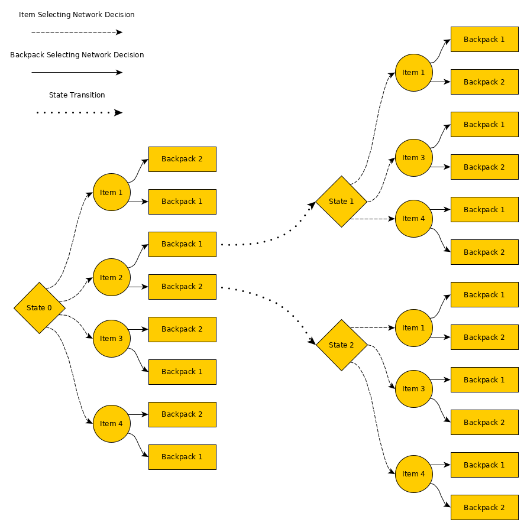

# Contents
- [Traveling Salesman Problem](#Traveling-Salesman-Problem)
- [Knapsack Problem](#Knapsack-Problem)
- [Multiple Knapsack Problem](#Multiple-Knapsack-Problem)
- [Resource Placement at Edge Devices](#Resource-Placement-At-Edge-Devices)

# Traveling Salesman Problem

**Problem statement**: Given a set of nodes, each located at {`x`, `y`}, the goal is to visit them in a way that the total traveling distance is minimized.

**Claim**: Given a set of nodes, it is possible to select them (by pointing) in a ___specific___ order that represents the (near) optimal visitation sequence.

**Goal of Pointer-Network** Given a set of nodes, the goal of the Pointer-Network is to sequentially point to the indexes of the input and, therefore, generate a sequence by which the nodes will be visited.

**Encoder Input** Represents the coordinates of the nodes

```bash
array([
    [ 0.,  0.],  -> Node 0. Location (0, 0). Also the starting point
    [ 1.,  1.],  -> Node 1. Location (1, 1) 
    [ 8.,  2.],  -> Node 2. Location (8, 2) 
    [ 5.,  0.],  -> Node 3. Location (5, 0) 
    ],
```


**Decoder Input** Represents the current previous location of the salesman. At the beginning it will be at the starting point.

```bash
array([
    [ 0.,  0.],  -> Salesman location at decoding step `0`. Location (0, 0) 
    ],
```

Assuming that at first decoding step the Pointer-Network "pointed" at Node 1, located at (1,1), the decoder's input for the next decoding step would be updated to:

```bash
array([
    [ 1.,  1.],  -> Salesman location at decoding step `1`. It is at the location of the Node 1.
    ],
```

After 4 decoding steps the Pointer-Network would have generated the following sequence: 

```
Node 1 -> Node 3 -> Node 2 -> Node 0
```

This sequence represents the solution to this particular problem. However, if the input of the problem changes the visitation sequence will also change.

## Goal of the Embedding Layers and the Attention
### Encoder's Embedding Layers
In this case in particular the embedding layers will represent, in a high dimensional space, the distance map between the nodes. Two nodes that are close to each other will have similar representations. Nodes that are distant from each other will have very different representations.

### Pointer-Network Attention
Given the encoder's and the decoder's input the attention will try to focus (by giving higher probability) on specific nodes that should be considered during the current decoding step.

# Knapsack Problem
**Problem statement**: Given a set of items, each with a weight `x` and value `y`, and a backpack with a capacity `c` the goal is to take the items in a way that the profit is maximized.

**Claim**: Given a set of items, it is possible to select them (by pointing) in a ___specific___ order that represents the (near) optimal picking sequence.

**Goal of Pointer-Network** Given a set of items and a backpack, the goal of the Pointer-Network is to sequentially point to the indexes of the input and, therefore, generate a sequence by which the items will be selected and placed in the backpack.

**Encoder Input** Represents the coordinates of the nodes

```bash
array([
    [ EOS, EOS ]   -> Item 0. Pointer-Net will point here if the items no longer fit.
    [ 5.,  5/7.],  -> Item 1. Value `5`. Occupies 5 units of space in a backpack with 7 units of capacity.
    [ 6.,  2/7.],  -> Item 2. Value `6`. Occupies 2 units of space in a backpack with 7 units of capacity.
    [ 7.,  1/7.],  -> Item 3. Value `7`. Occupies 1 units of space in a backpack with 7 units of capacity.
    [ 2.,  3/7.],  -> Item 4. Value `2`. Occupies 3 units of space in a backpack with 7 units of capacity.
    ],
```


**Decoder Input** Represents the previously select item. At the beginning it will be at the [SOS, SOS].

```bash
array([
    [ 0.,  0.],  -> Start the decoding process.
    ],
```

> Note: For more info see [A Pointer Network Based Deep Learning Algorithm for 0-1 Knapsack Problem](https://ieeexplore.ieee.org/document/8377505).

Assuming that at first decoding step the Pointer-Network "pointed" at Item 2, represented as [7., 1/7],  the decoder's input for the next decoding step would be updated to:

```bash
array([
    [ 7.,  1/7.],  -> Item decoded in the previous decoding step.
    ],
```

After 4 decoding steps the Pointer-Network would have generated the following sequence: 

```
Item 3 -> Item 2 -> Item 4 -> Item 0
```

This sequence represents the solution by which the items should be selected.

## Goal of the Embedding Layers and the Attention
### Encoder's Embedding Layers
In this case in particular the embedding layers will represent, in a high dimensional space, weight to value ration between an item and the backpack.

### Pointer-Network Attention
Given the encoder's and the decoder's input the attention will try to focus (by giving higher probability) on specific items that should selected and placed into the backpack during the current decoding step. In other words, given the remaining items and knowing the last selected item the attention will point to the next item that should be selected.

### Problem with this approach
How to handle the multiple knapsack problem? 

# Multiple Knapsack Problem
**Problem statement**: Given a set of items, each with a weight `x` and value `y`, and a set of backpacks, each with a capacity `c`, the goal is to take the items and place them into the backpacks in a way that the total profit is maximized.

**Problems with the previous approach**
- [Previous approach](#Knapsack-Problem) is not able to work with multiple backpacks.

- One possibility to solve this problem is break it into multiple sub-problems, i.e., select a specific backpack from a set and then try to insert all the items. Then, select another backpack and try to insert the remaining items. However, what's the order by which the backpacks should be selected? Sort them descending order by their capacities? Will this approach work well every time? No, because after inserting an item into the backpack we cannot take it back until the end of the decoding process.

- What if we invert the problem? Pick a single item and try to place it across multiple backpacks. Then, take another item and repeat the process. In this case, what would be the sequence by which we would select the items? Start by the items with the highest cost? Will this approach work well every time? No. Given the fact that we cannot remove the item from the backpack. The item selection and its placement, into a specific backpack, must be done in a way that "we know" the remaining items that still need to be placed and the state of the backpacks.

- While the items are independent from each other their placement is not. Placing an item at a specific backpack **can and will** affect the way by which other items are be placed.

**Why "classical" heuristic produce sub-optimal results?** 
The "classical" heuristics are "static", i.e., they perform the same item selection and placement procedure regardless of the input. This means that for specific inputs they will generate suboptimal results. For example, for the following input the heuristic from [Neural Combinatorial Optimization with Reinforcement Learning](https://arxiv.org/pdf/1611.09940.pdf) (`A simple yet strong heuristic is to take the items ordered by their weight-to-value ratios until they fill up the weight capacity`):

```bash
array([
    [ 0., 0.],  -> Backpack EOS. Not selected items will be "placed" here
    [ 4., 0.],  -> Backpack 1. Capacity: 4     | Current Load: 0
    [ 3., 0.],  -> Backpack 2. Capacity: 4     | Current Load: 0
    [ 3., 3.],  -> Item 1. Weight: 3  | Value : 3
    [ 2., 2.],  -> Item 2. Weight: 2  | Value : 2
    [ 2., 2.]   -> Item 3. Weight: 2  | Value : 2
    ],
    dtype=float32, shape=(11, 2))
```

would get reward equal to 5, because the first Item 1 (weight: 3, value: 3) would be placed into the first Backpack 1 (capacity: 4). After that, only one of the remaining items would fit the backpacks.

In this case, the optimal solution would be placing the Item 1 (weight: 3, value: 3) into the Backpack 2 (capacity: 3) and the remaining two items would be placed into the first backpack. In this case, the reward would be equal to 7 and the backpacks would reach their maximum capacity.

**Claim**: Given a set of items and the backpacks, it is possible to select them (by pointing) in a ___specific___ way that generates (near) optimal picking and placing sequence.

**Multiple Knapsack Problem Decision Tree** Each iteration in Multiple Knapsack Problem consists of two decisions: `1)` item selection; `2)` backpack selection. 

**Graphical representation of the decision tree**

> Note: In this case Item 2 was selected during the first decision step.

After selecting a specific item and placing it at a specific backpack the state of the problem changes, i.e., we have one less item to select and the capacity of the backpack is now different. Once the item is inserted it cannot be extracted, which means that selecting and placing a specific item during in the decision tree can yield sub-optimal results. Hence, a careful selection and placement must be done throughout the whole process. 

**Goal of Double Pointer-Network**  The idea of Double Pointer-Network is to mimic this two decision process with two dedicated neural networks. The first one will be responsible for selecting the item and the second one will be responsible for selecting the appropriate backpack for the item. 

Both networks are fed with the information about all the items that can be selected and the current state of the backpacks. This allows the Item selecting network to make the item selection decision based on the remaining items and the current state of the backpacks. Same thing happens with the Backpack selecting network whose decision is not only based on a current item but also on the knowledge about the remaining items that need to be inserted. Having knowledge about the remaining items allows the network to take less greedy decisions. This process kind of mimics the following idea: `I will place this item into this backpack _because_ I know that I still have to insert others. Therefore, placing current item at this specific backpack will allow me (in the future) to pack the remaining items in a better way`.

**The proposed architecture**


**Encoder Input** Represents the state of the backpacks and the items that can be picked.

```bash
array([
    [ 0.,  0.],  -> Backpack EOS. Not selected items will be "placed" here
    [ 7.,  0.],  -> Backpack 1. Capacity: 7     | Current Load: 0
    [ 8.,  0.],  -> Backpack 2. Capacity: 8     | Current Load: 0
    [13.,  0.],  -> Backpack 3. Capacity: 13    | Current Load: 0
    [ 8.,  0.],  -> Backpack 4. Capacity: 8     | Current Load: 0
    [ 6.,  0.],  -> Backpack 5. Capacity: 6     | Current Load: 0
    [ 5., 38.],  -> Item 1. Weight: 5   | Value : 38
    [11., 42.],  -> Item 2. Weight: 11  | Value : 42
    [ 9., 46.],  -> Item 3. Weight: 9   | Value : 46
    [17., 23.],  -> Item 4. Weight: 17  | Value : 23
    [20.,  8.]   -> Item 5. Weight: 20  | Value : 8
    ],
    dtype=float32, shape=(11, 2))
```

**Item Selecting Decoder Input** Represents the previously select item. At the beginning it will be at the [SOS, SOS].

```bash
array([
    [ 0.,  0.],  -> Start the decoding process.
    ],
```

**Backpack Selecting Decoder Input** Represents the item that was selected by previous network.

```bash
array([
    [ 5.,  38.],  -> Start the decoding process.
    ],
```

After 5 decoding steps (we have 5 items to place), the Pointer-Network would have generated the following sequence: 

```
(Item 3, Backpack 1) -> (Item 1, Backpack 2) -> (Item 4, Backpack 5) -> (Item 2, Backpack 1) -> (Item 4, Backpack 3)
```

This sequence represents the solution by which the items should be selected and the location where they should be placed.

## Goal of the Embedding Layers and the Attention
### Encoder's Embedding Layers
In this case in particular the embedding layers will simply represent, in a high dimensional space, the items and the backpacks. Similar items will have similar representations (same for the backpacks).

### Transformer's Encoder Attention
The self-attention mechanism allows the inputs to interact with each other (“self”) and find out who they should pay more attention to (“attention”). The outputs are aggregates of these interactions and attention scores. In the case of the multiple knapsack problem, the attention will "learn" that specific items and specific backpacks tend to generate higher rewards. Lower probabilities (between the item and the backpack) in the attention will mean that for a specific item the network should not consider trying to insert it into the specific backpack because it will generate bad rewards.

In other words, the encoder's attention is looking for possible (good) contender backpack for each item. Moreover, the contender selection also takes into the account the existence of other items because they are also fed into the encoder.

Moreover, the by using the self-attention during the encoding process we ensure that the output data is invariant to the input order. This is an important issue when dealing with the data is not a sequence but a set. For more info about it check: [Order Matters: Sequence to sequence for sets](https://arxiv.org/pdf/1511.06391.pdf). The Transformer's self-attention, without the positional encoding, makes the data invariant. For more info check: [Attention, Learn to Solve Routing Problems!](https://arxiv.org/abs/1803.08475).

### Pointer-Network Attention
Given the encoder's and the decoder's input the attention will try to focus (by giving higher probability) on specific items that should selected. In other words, given the remaining items, the state of the backpacks and knowing the last selected item the attention will point to the next item that should be selected.

### Results

The performance of the network was compared against [Google OR-Tools](https://developers.google.com/optimization/bin/multiple_knapsack) and a simple heuristic. The heuristic consists in sorting the backpacks, by their capacities, and the items, by the value-to-weight ration, in a descending order (as in [Neural Combinatorial Optimization with Reinforcement Learning](https://arxiv.org/pdf/1611.09940.pdf)). After that the items are placed in a first place (i.e., backpack) that fits.

#### Small Problem

Environment configuration for testing and training:
- Set size of items: `100`
- Item value: random in [`1`, `100`] range
- Item weight: random in [`1`, `20`] range
- Set size of backpacks: `20`
- Backpack capacities: random in [`1`, `20`] range

Training configs:
- Batch size: `32`
- Number of epochs: `5000`
- Total number of problem instances used during training: `32 * 5000 = 160000` 
- Item sample size: `20`
- Backpack sample size: `5`

Testing configs:
- Batch size: `32`
- Item sample size: `20`
- Backpack sample size: `5 + 1`. `+ 1` is the empty backpack where items that weren't selected are placed.

```bash
Opt 369.0       | Net 352.0 | % from Opt 4.61 || Heuristic 352.0     | % from Opt 4.61
Opt 654.0       | Net 593.0 | % from Opt 9.33 || Heuristic 578.0     | % from Opt 11.62
Opt 443.0       | Net 443.0 | % from Opt 0.00 || Heuristic 374.0     | % from Opt 15.58
Opt 666.0       | Net 637.0 | % from Opt 4.35 || Heuristic 637.0     | % from Opt 4.35
Opt 624.0       | Net 612.0 | % from Opt 1.92 || Heuristic 567.0     | % from Opt 9.13
Opt 606.0       | Net 602.0 | % from Opt 0.66 || Heuristic 565.0     | % from Opt 6.77
Opt 514.0       | Net 497.0 | % from Opt 3.31 || Heuristic 479.0     | % from Opt 6.81
Opt 559.0       | Net 505.0 | % from Opt 9.66 || Heuristic 520.0     | % from Opt 6.98
Opt 683.0       | Net 668.0 | % from Opt 2.20 || Heuristic 636.0     | % from Opt 6.88
Opt 450.0       | Net 415.0 | % from Opt 7.78 || Heuristic 415.0     | % from Opt 7.78
Opt 484.0       | Net 484.0 | % from Opt 0.00 || Heuristic 425.0     | % from Opt 12.19
Opt 494.0       | Net 477.0 | % from Opt 3.44 || Heuristic 457.0     | % from Opt 7.49
Opt 664.0       | Net 648.0 | % from Opt 2.41 || Heuristic 583.0     | % from Opt 12.20
Opt 532.0       | Net 515.0 | % from Opt 3.20 || Heuristic 496.0     | % from Opt 6.77
Opt 657.0       | Net 614.0 | % from Opt 6.54 || Heuristic 587.0     | % from Opt 10.65
Opt 661.0       | Net 661.0 | % from Opt 0.00 || Heuristic 606.0     | % from Opt 8.32
Opt 500.0       | Net 500.0 | % from Opt 0.00 || Heuristic 468.0     | % from Opt 6.40
Opt 613.0       | Net 601.0 | % from Opt 1.96 || Heuristic 601.0     | % from Opt 1.96
Opt 417.0       | Net 415.0 | % from Opt 0.48 || Heuristic 378.0     | % from Opt 9.35
Opt 639.0       | Net 574.0 | % from Opt 10.17 || Heuristic 574.0     | % from Opt 10.17
Opt 583.0       | Net 575.0 | % from Opt 1.37 || Heuristic 575.0     | % from Opt 1.37
Opt 592.0       | Net 584.0 | % from Opt 1.35 || Heuristic 486.0     | % from Opt 17.91
Opt 560.0       | Net 552.0 | % from Opt 1.43 || Heuristic 502.0     | % from Opt 10.36
Opt 650.0       | Net 594.0 | % from Opt 8.62 || Heuristic 559.0     | % from Opt 14.00
Opt 599.0       | Net 555.0 | % from Opt 7.35 || Heuristic 507.0     | % from Opt 15.36
Opt 673.0       | Net 630.0 | % from Opt 6.39 || Heuristic 611.0     | % from Opt 9.21
Opt 623.0       | Net 613.0 | % from Opt 1.61 || Heuristic 583.0     | % from Opt 6.42
Opt 841.0       | Net 793.0 | % from Opt 5.71 || Heuristic 747.0     | % from Opt 11.18
Opt 464.0       | Net 446.0 | % from Opt 3.88 || Heuristic 464.0     | % from Opt 0.00
Opt 525.0       | Net 500.0 | % from Opt 4.76 || Heuristic 500.0     | % from Opt 4.76
Opt 498.0       | Net 495.0 | % from Opt 0.60 || Heuristic 409.0     | % from Opt 17.87
Opt 733.0       | Net 692.0 | % from Opt 5.59 || Heuristic 653.0     | % from Opt 10.91
```

#### Large Problems
For more than 20 items and 10 backpack Google OR-Tools take a massive amount of time to find a solution. Hence, we can only compare the Neural Net against the heuristic. 

Environment configuration for testing and training:
- Set size of items: `100`
- Item value: random in [`1`, `100`] range
- Item weight: random in [`1`, `20`] range
- Set size of backpacks: `20`
- Backpack capacities: random in [`1`, `20`] range

Training configs:
- Batch size: `32`
- Number of epochs: `5000`
- Total number of problem instances used during training: `32 * 5000 = 160000` 
- Item sample size: `20`
- Backpack sample size: `5`

> **Note:** For building a single problem instance the items and backpacks are randomly sampled from their respective sets

Testing configs:
- Batch size: `32`
- Item sample size: `50`
- Backpack sample size: `10 + 1`. `+ 1` is the empty backpack where items that weren't selected are placed.

**Item are selected by the first network**
```bash
Net 1303.0      | Heuristic 1215.0      | % from Heuristic -7.24
Net 1259.0      | Heuristic 1132.0      | % from Heuristic -11.22
Net 1321.0      | Heuristic 1236.0      | % from Heuristic -6.88
Net 1244.0      | Heuristic 1153.0      | % from Heuristic -7.89
Net 1122.0      | Heuristic 994.0       | % from Heuristic -12.88
Net 1065.0      | Heuristic 949.0       | % from Heuristic -12.22
Net 1195.0      | Heuristic 1069.0      | % from Heuristic -11.79
Net 1333.0      | Heuristic 1222.0      | % from Heuristic -9.08
Net 1259.0      | Heuristic 1136.0      | % from Heuristic -10.83
Net 1234.0      | Heuristic 1083.0      | % from Heuristic -13.94
Net 1204.0      | Heuristic 1079.0      | % from Heuristic -11.58
Net 1243.0      | Heuristic 1104.0      | % from Heuristic -12.59
Net 1423.0      | Heuristic 1312.0      | % from Heuristic -8.46
Net 1341.0      | Heuristic 1242.0      | % from Heuristic -7.97
Net 1373.0      | Heuristic 1213.0      | % from Heuristic -13.19
Net 1035.0      | Heuristic 958.0       | % from Heuristic -8.04
Net 1385.0      | Heuristic 1227.0      | % from Heuristic -12.88
Net 1166.0      | Heuristic 1022.0      | % from Heuristic -14.09
Net 1472.0      | Heuristic 1291.0      | % from Heuristic -14.02
Net 1486.0      | Heuristic 1353.0      | % from Heuristic -9.83
Net 1359.0      | Heuristic 1269.0      | % from Heuristic -7.09
Net 1157.0      | Heuristic 1080.0      | % from Heuristic -7.13
Net 1238.0      | Heuristic 1142.0      | % from Heuristic -8.41
Net 1203.0      | Heuristic 1124.0      | % from Heuristic -7.03
Net 1265.0      | Heuristic 1170.0      | % from Heuristic -8.12
Net 1423.0      | Heuristic 1343.0      | % from Heuristic -5.96
Net 1340.0      | Heuristic 1232.0      | % from Heuristic -8.77
Net 1253.0      | Heuristic 1127.0      | % from Heuristic -11.18
Net 1097.0      | Heuristic 955.0       | % from Heuristic -14.87
Net 1364.0      | Heuristic 1226.0      | % from Heuristic -11.26
Net 1339.0      | Heuristic 1231.0      | % from Heuristic -8.77
Net 1289.0      | Heuristic 1213.0      | % from Heuristic -6.27
```

Results for the same problem but comparing against slightly different heuristic. The heuristic still sorts the items in a descending weight-to-value ration but the backpacks are sorted in an ascending order by their capacities. This means that items with the best weight-to-value ration will be placed in smaller backpacks.

```bash
Net 1200.0      | Heuristic 1163.0      | % from Heuristic -3.18
Net 1112.0      | Heuristic 1118.0      | % from Heuristic 0.54
Net 1323.0      | Heuristic 1283.0      | % from Heuristic -3.12
Net 1226.0      | Heuristic 1179.0      | % from Heuristic -3.99
Net 1185.0      | Heuristic 1116.0      | % from Heuristic -6.18
Net 1360.0      | Heuristic 1304.0      | % from Heuristic -4.29
Net 1416.0      | Heuristic 1354.0      | % from Heuristic -4.58
Net 1251.0      | Heuristic 1129.0      | % from Heuristic -10.81
Net 1181.0      | Heuristic 1132.0      | % from Heuristic -4.33
Net 1247.0      | Heuristic 1180.0      | % from Heuristic -5.68
Net 1072.0      | Heuristic 993.0       | % from Heuristic -7.96
Net 1340.0      | Heuristic 1254.0      | % from Heuristic -6.86
Net 1397.0      | Heuristic 1307.0      | % from Heuristic -6.89
Net 1190.0      | Heuristic 1096.0      | % from Heuristic -8.58
Net 1171.0      | Heuristic 1132.0      | % from Heuristic -3.45
Net 1099.0      | Heuristic 1006.0      | % from Heuristic -9.24
Net 1175.0      | Heuristic 1135.0      | % from Heuristic -3.52
Net 1542.0      | Heuristic 1488.0      | % from Heuristic -3.63
Net 1069.0      | Heuristic 1031.0      | % from Heuristic -3.69
Net 1322.0      | Heuristic 1260.0      | % from Heuristic -4.92
Net 1336.0      | Heuristic 1271.0      | % from Heuristic -5.11
Net 1327.0      | Heuristic 1297.0      | % from Heuristic -2.31
Net 1337.0      | Heuristic 1272.0      | % from Heuristic -5.11
Net 1403.0      | Heuristic 1320.0      | % from Heuristic -6.29
Net 1408.0      | Heuristic 1359.0      | % from Heuristic -3.61
Net 1167.0      | Heuristic 1103.0      | % from Heuristic -5.80
Net 1195.0      | Heuristic 1096.0      | % from Heuristic -9.03
Net 1358.0      | Heuristic 1288.0      | % from Heuristic -5.43
Net 1407.0      | Heuristic 1332.0      | % from Heuristic -5.63
Net 1184.0      | Heuristic 1146.0      | % from Heuristic -3.32
Net 1297.0      | Heuristic 1216.0      | % from Heuristic -6.66
Net 1267.0      | Heuristic 1190.0      | % from Heuristic -6.47
```

Same test were performed but in this case the item selecting network were removed. Instead of the network feeding the items into the backpack selecting net, the items were selected in random order and sequentially, i.e., from the first to last in each problem instance. In both cases the results were similar. Below are the results for the random selection. Looking at the results it's possible to see that single network approach can't outperform the heuristic.

**Random item selection**
```bash
Net 917.0       | Heuristic 1062.0      | % from Heuristic 13.65
Net 1095.0      | Heuristic 1175.0      | % from Heuristic 6.81
Net 980.0       | Heuristic 971.0       | % from Heuristic -0.93
Net 1045.0      | Heuristic 1141.0      | % from Heuristic 8.41
Net 919.0       | Heuristic 1093.0      | % from Heuristic 15.92
Net 976.0       | Heuristic 1125.0      | % from Heuristic 13.24
Net 840.0       | Heuristic 1019.0      | % from Heuristic 17.57
Net 1081.0      | Heuristic 1078.0      | % from Heuristic -0.28
Net 1023.0      | Heuristic 1136.0      | % from Heuristic 9.95
Net 1009.0      | Heuristic 1279.0      | % from Heuristic 21.11
Net 1058.0      | Heuristic 1075.0      | % from Heuristic 1.58
Net 952.0       | Heuristic 1103.0      | % from Heuristic 13.69
Net 1018.0      | Heuristic 1131.0      | % from Heuristic 9.99
Net 956.0       | Heuristic 960.0       | % from Heuristic 0.42
Net 1033.0      | Heuristic 1190.0      | % from Heuristic 13.19
Net 1083.0      | Heuristic 1157.0      | % from Heuristic 6.40
Net 983.0       | Heuristic 1198.0      | % from Heuristic 17.95
Net 1158.0      | Heuristic 1161.0      | % from Heuristic 0.26
Net 905.0       | Heuristic 982.0       | % from Heuristic 7.84
Net 919.0       | Heuristic 1022.0      | % from Heuristic 10.08
Net 883.0       | Heuristic 904.0       | % from Heuristic 2.32
Net 962.0       | Heuristic 1138.0      | % from Heuristic 15.47
Net 1053.0      | Heuristic 1044.0      | % from Heuristic -0.86
Net 868.0       | Heuristic 1039.0      | % from Heuristic 16.46
Net 1000.0      | Heuristic 1098.0      | % from Heuristic 8.93
Net 1015.0      | Heuristic 1120.0      | % from Heuristic 9.38
Net 1121.0      | Heuristic 1139.0      | % from Heuristic 1.58
Net 942.0       | Heuristic 1064.0      | % from Heuristic 11.47
Net 1131.0      | Heuristic 1157.0      | % from Heuristic 2.25
Net 921.0       | Heuristic 1204.0      | % from Heuristic 23.50
Net 916.0       | Heuristic 1185.0      | % from Heuristic 22.70
Net 930.0       | Heuristic 1135.0      | % from Heuristic 18.06
```

# Resource Placement at Edge Devices
**Problem statement**: At each time `t` a randomly sized batch of user's requests arrive, each has its own profile that contains information about the amount of resources (e.g., [`10` units of CPU, `2` units of RAM, `5` units for Memory]) that it needs in order to be processed properly. The incoming requests must be placed at a set of available nodes, each having its own processing capabilities (e.g., [`100` units of CPU, `20` units of RAM, `50` units for Memory]). In real world, these nodes usually are located behind a reverse proxy such as NGNIX, Traefik or Moleculer API Gateway. All of them provide load balancing capabilities. NGNIX [offers](http://nginx.org/en/docs/http/load_balancing.html) round-robin, least-connected, ip-hash; Traefik, at this moment, only [supports](https://docs.traefik.io/routing/services/#load-balancing) round-robin method; Moleculer API Gateway [offers](https://moleculer.services/docs/0.14/balancing.html#Built-in-strategies) round-robin, random, CPU usage-based and sharding. These load balancing strategies don't provide optimal solution, it's too expensive too look for it in real-time, they simply follow the selected load balancing strategy. These strategies are fast but the results that they provide can be suboptimal.

**Goal**: The goal is to design another load balancing strategy that's able to distribute the incoming requests in a fair way, i.e., in a way that the incoming requests have similar working conditions.

**Purpose of the Neural-based load balancing strategy**: A Neural-based load balancing strategy can adapt the distribution policy (heuristic) according to the incoming user's requests and the state of the nodes and, thus, offer a better way of placing the requests.