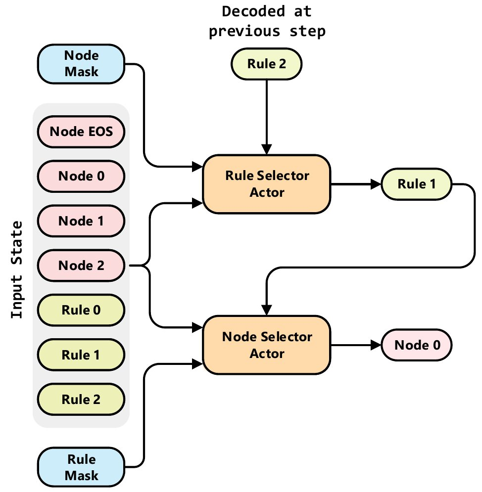

# Double Transformer Pointer-Critic

**For the rationale behind the architecture please check [Architecture Rationale](./Arch_Rationale.md)**

## Architecture Details

**Simple Overview**


**Detailed Overview**


## Resource Placement at Edge Devices

### Tech Background

In Web of Things (WoT), where every device resource is URI addressable, the event processing can be seen as a three stage process: `observation` of one or many endpoints, `evaluation` of the data produced and `actuation` by sending notifications to one or more endpoints. Together these elements form the resource synchronization mechanism, where resources are located at URI addressable endpoints.
One of such synchronization mechanisms is the `Rule` resource (a detailed description about the `Rule` can be seen in our [previous paper](https://ieeexplore.ieee.org/document/8928976)).
It is not expected that end-users would directly configure the `Rules` by hand - although they certainly could do that if they wanted to. The expected way is to have applications (e.g., app store) where the user can go and find a pre-configured `Rule` that it needs. A hypothetical `Rule` app store could also provide meta-data about each `Rule`. For example, the meta-data could contain the information about CPU, RAM and memory requirements of each `Rule`, i.e., each `Rule` could have it's own profile.
Overall, the `Rule` is a web resource that can be placed at any device/node that implements `Rule`'s API (REST API to be precise). However, in heterogeneous IoT environments the `Rule` placement must be careful and planned accordingly to the computational resources available in the vicinity.

In IETF's draft called [`IoT Edge Challenges and Functions`](https://t2trg.github.io/t2trg-iot-edge-computing/draft-hong-t2trg-iot-edge-computing.html) they highlight the need of edge computing for the new generation of IoT applications, whose requirements cannot be met by the cloud. In this document they [outline](https://t2trg.github.io/t2trg-iot-edge-computing/draft-hong-t2trg-iot-edge-computing.html#name-iot-edge-computing-function) the need of `virtualization platforms that enable the deployment of virtual edge computing functions` near the devices. They also state that `end devices are envisioned to become computing devices in forward looking projects, but are not commonly used as such today`. 

Following the IETF's line of thought, the `Rule` (or any other synchronization mechanism) will be processed at the edge devices that are deployed in the vicinity or on the premises. Users will generate requests (e.g., via HTTP POST) and these requests must be distributed across a set of devices/nodes/servers that are deployed and available for processing.

There are several initiatives that move in the direction outlined by the IETF:

- [Edge Virtualization Engine (EVE)](https://www.lfedge.org/projects/eve/) `aims to do for the IoT edge what Android did for mobile by creating an open edge computing engine that enables the development, orchestration and security of cloud-native and legacy applications on distributed edge compute nodes. Supporting containers and clusters (Dockers and Kubernetes), virtual machines and unikernels, Project EVE aims to provide a flexible foundation for IoT edge deployments with choice of any hardware, application and cloud.` Moreover `EVE runtime can be deployed on any bare metal hardware (e.g. x86, Arm, GPU) or within a VM to provide consistent system and orchestration services, plus the ability to run applications in a variety of formats. Orchestration of the underlying hardware and installed software is achieved through the open EVE API, providing developers with consistent behavior across a diverse mix of technology ingredients. Offering consistency and flexibility while maintaining a robust, state-of-the-art security posture is a key project tenet.`

- [EdgeX Foundry](https://www.edgexfoundry.org/) is a service platform that also aims to provide management, data persistance or streaming near the edge. Moreover, this project in particular defines a custom rule engine API that shares similarities with the `Rule` API.

- [MobiledgeX](https://mobiledgex.com/) is a edge-cloud platform that provides and environment for the developers to deploy software (e.g., as software containers) on the edge.

Today, in a typical application deployment, the devices/nodes/servers (virtual or physical) are usually located behind a [reverse proxy](https://en.wikipedia.org/wiki/Reverse_proxy) such as NGNIX, Traefik or Moleculer API Gateway.
A reverse proxy server is a type of proxy server that typically sits behind the firewall in a private network and directs client requests to the appropriate backend server. A reverse proxy provides an additional level of abstraction and control to ensure the smooth flow of network traffic between clients and servers.
Common feature that reverse proxies provide is load balancing, web acceleration (e.g., caching, SSL encryption), security and anonymity. 
In case of load balancing there are several balancing strategies that can be used. For example, NGNIX [offers](http://nginx.org/en/docs/http/load_balancing.html) round-robin, least-connected, ip-hash; Traefik, at this moment, only [supports](https://docs.traefik.io/routing/services/#load-balancing) round-robin method; Moleculer API Gateway [offers](https://moleculer.services/docs/0.14/balancing.html#Built-in-strategies) round-robin, random, CPU usage-based and sharding. These load balancing strategies don't provide optimal solutions because it's too expensive to look for them in real-time. Instead, these strategies trade the quality of solution for the response time, i.e., these strategies are fast but the solutions that they provide can be suboptimal.

In containerized environments, where nodes are running in isolated containers, there is usually a container manager (e.g., Kubernetes). One of the features that these container managers provide is [autoscaling](https://kubernetes.io/blog/2016/07/autoscaling-in-kubernetes/). Autoscaling allows to dynamically scale the number of nodes/servers, by creating (or destroying) replicas, according current load of the system.
[StarlingX](https://www.starlingx.io/) is a project (similar to Kubernetes) that is specifically designed for IoT applications located at the edge. StarlingX is a virtualization manager that aims to simplify the management, orchestration and scaling of distributed edge-cloud computing devices.

Regardless of the number of nodes currently running (due to autoscaling), the load balancers, that reverse proxies provide, must still distribute the incoming requests across all the available nodes. Also, in a typical web application the number of user's requests that the system receives at a specific instant is dynamic. The arrival of new requests may be erratic, there might be spikes of requests during short periods of time and then there might be periods of slowdown. Nevertheless, the load balancing strategies need to be able to handle any given situation.

Overall, any new load balancing strategy must be scalable and adaptable to the dynamics of the system, both in terms of incoming requests and the number of available nodes/servers.

### Problem statement

Given a set of nodes/devices available for processing. Each node has the following characteristics:
- `100` (or any other value) remaining units of CPU that available for processing
- `100` (or any other value) remaining units of RAM that available for processing
- `100` (or any other value) remaining units of memory that available for processing

Moreover, each node has a set of web clients (e.g., HTTP, WebSocket) and it maintains a set of active connections with a set of APIs (data sources) from where it constantly getting fresh data. The set of data that's being fetched from these APIs is represented by a range:
- `2` lower bound of the API (data source) that the node is connected with
- `5` upper bound of the API (data source) that the node is connected with

This range means that the node maintains active connections with APIs `2`, `3`, `4`, `5` and that it constantly fetching, processing and caching the data.
For example, the range defined above might represent the following active connections: `2` - weather API service, `3` - earthquake API service, `4` - pollution API, `5` - traffic camera. In case of task `5` (traffic camera), the node might use a neural network to process the image stream and count the number of cars, pedestrians, etc. This information would be cached by the node and, later, used by a `Rule` that needs this kind of information.
In the case of the weather API service, the node might simply fetch and store weather data of a complete region (e.g., city or country) and then only use a specific portion of the data for a specific `Rule`.

Keeping active connections and constantly processing and caching the data requires resources. This means every node can only handle a set of active connections and cache the incoming data. In other words, this means that some nodes will be "specialized" in storing/caching specific type of data.

Moreover, at each time `t` a randomly sized batch of requests arrive, each has its own profile with the following information:

The information about the user that created the request. For example:
- `1` or `0` depending if the user is `premium` or `free`

The amount of resources that it needs in order to be processed. For example:
- `10` (or any other value) units of CPU
- `2` (or any other value) units of RAM
- `5` (or any other value) units for Memory

The profile also contains info about the data source that the request needs. For example:
- `2` (or any other number) that represents the specific type of the data source that the request needs.

> **Note**: In the example above the request type `2` might represent type of a `Rule` that needs information from a weather API (e.g., [Open Weather Map](https://openweathermap.org/api), [Aeris Weather](https://www.aerisweather.com/features/aerisweather-solutions/)) or traffic API services (e.g., [Here Traffic API](https://developer.here.com/documentation/traffic/dev_guide/topics/what-is.html)). 


Overall, for a specific `Rule` to be processed, there are two costs involved: one is the "cost" (CPU/RAM/MEM) involved in the reasoning over the actual `Rule` and another one is the "cost" (CPU/RAM/MEM) of keeping an active connection with an external API in order to constantly having fresh data and processing the incoming data. 

> **Note**: The cost of processing the `Rule` is defined in its profile. The cost of fetching data could some constant.

If a `Rule` request is placed at the node that already has the desired data then there is only one "cost", i.e., the "cost" of processing the rule. If it's placed at a node that doesn't have in cache the desired information then there is a additional "penalty cost", i.e., the cost of fetching and processing the required data.

### Goal

The goal is to design a load balancing strategy that's able to distribute the incoming requests across the devices. The designed strategy must prioritize the `premium` requests but at the same time satisfy the `free` requests. By providing good quality-of-service for the `free` users it's more probable for them to become `premium` and recommend the system to other users.

### Purpose of the Neural-based load balancing strategy
 
A Neural-based load balancing strategy can adapt the distribution policy (heuristic) according to the incoming user's requests and the state of the nodes and, thus, offer a "better" way of placing the requests.

### Input Representation

```python
array([
    [ 0., 0., 0., 0., 0.],  -> Node EOS. Rejected items will be "placed" here
    [ 70., 80., 40., 4., 7.] -> Node 1. Remaining CPU: 70 | Remaining RAM: 80 | Remaining Memory: 40 | Tasks without penalty `4`, `5`, `6`, `7`
    [ 50., 40., 20., 1., 4.] -> Node 2. Remaining CPU: 50 | Remaining RAM: 40 | Remaining Memory: 20 | Tasks without penalty `1`, `2`, `3`, `4`
    [ 10., 12., 17., 3., 0.] -> Request 1. Required CPU: 10 | Required RAM: 12 | Required Memory: 17 | Task: 3 | User Type: 0 (`free`)
    [ 18., 32., 16., 4., 1.] -> Request 2. Required CPU: 18 | Required RAM: 32 | Required Memory: 16 | Task: 4 | User Type: 1 (`premium`)
    ],
    dtype=float32, shape=(5, 5))
```

### Training

The devices/nodes can have large capacities for rule processing, i.e., they can "hold" more resources that the ones that are present in a problem instance.
In other words, the nodes won't be full after a single episode. However, we want for the neural network to learn how to distribute the resources for any possible state of the nodes. Therefore, the devices/nodes are "recycled" for multiple episodes. By "recycled" I mean that after resetting the environment the state of the devices/nodes is kept for multiple episodes. The state of the nodes at the end of the episode `e` will be the initial state of the nodes at the episode `e+1`. What changes between the episode is the requests.

### Testing

`What measurements to take???`

## Useful Links
- [Deep Reinforcement Learning: Pong from Pixels](http://karpathy.github.io/2016/05/31/rl/)
- [Deriving Policy Gradients and Implementing REINFORCE](https://medium.com/@thechrisyoon/deriving-policy-gradients-and-implementing-reinforce-f887949bd63)
- [Understanding Actor Critic Methods and A2C](https://towardsdatascience.com/understanding-actor-critic-methods-931b97b6df3f)
- [Beam Search](https://machinelearningmastery.com/beam-search-decoder-natural-language-processing/)

### Pointer Critic
- [Neural Combinatorial Optimization with Reinforcement Learning](https://arxiv.org/pdf/1611.09940.pdf)
- [Presentation Video - Neural Combinatorial Optimization with Reinforcement Learning](https://www.youtube.com/watch?v=mxCVgVrUw50)
- [Reviews - Neural Combinatorial Optimization with Reinforcement Learning](https://openreview.net/forum?id=rJY3vK9eg)
- [Reinforcement Learning for Solving the Vehicle Routing Problem](https://arxiv.org/pdf/1802.04240.pdf)
- [Order Matters: Sequence to sequence for sets](https://arxiv.org/pdf/1511.06391.pdf)
- [Attention, Learn to Solve Routing Problems!](https://arxiv.org/abs/1803.08475)

### Unit Test and Coverage
```bash
python environment/custom/resource/tests/runner.py
```
or to generate an HTML-based coverage file
```bash
coverage run tests/runner.py
coverage html --omit=*/venv/*,*/usr/*,*/lib/*,*/tests/* -i
```

or combo
```
coverage run tests/runner.py && coverage html --omit=*/venv/*,*/usr/*,*/lib/*,*/tests/* -i
```