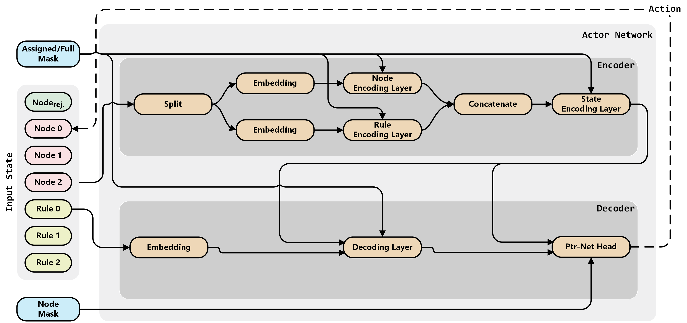
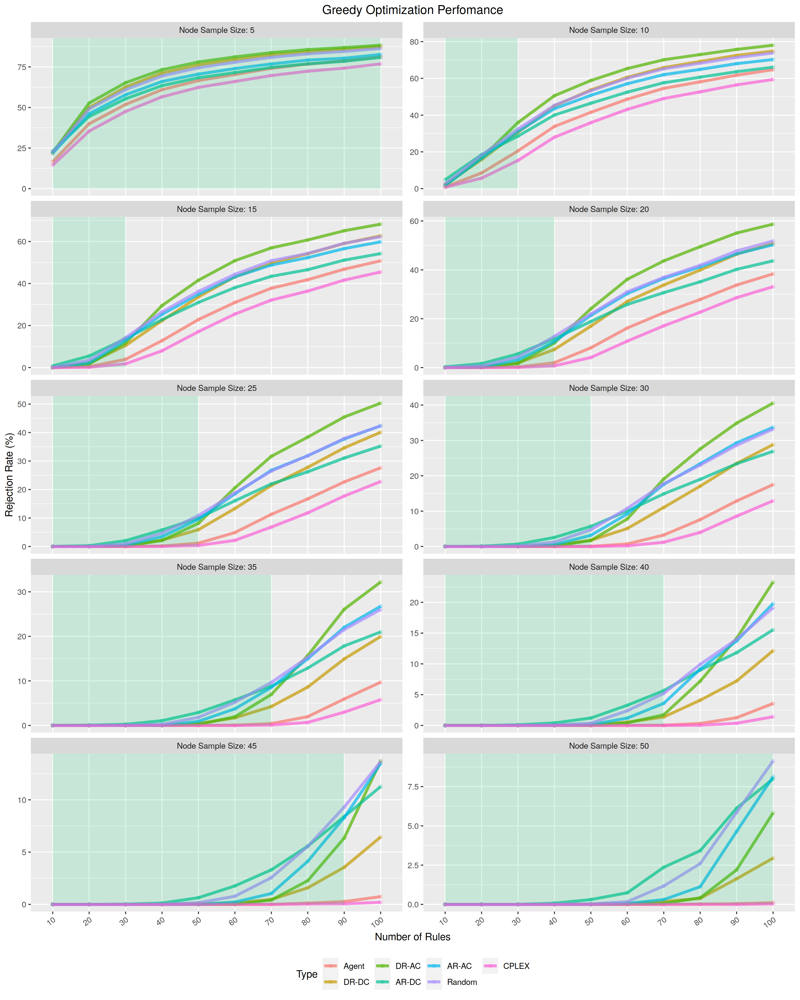
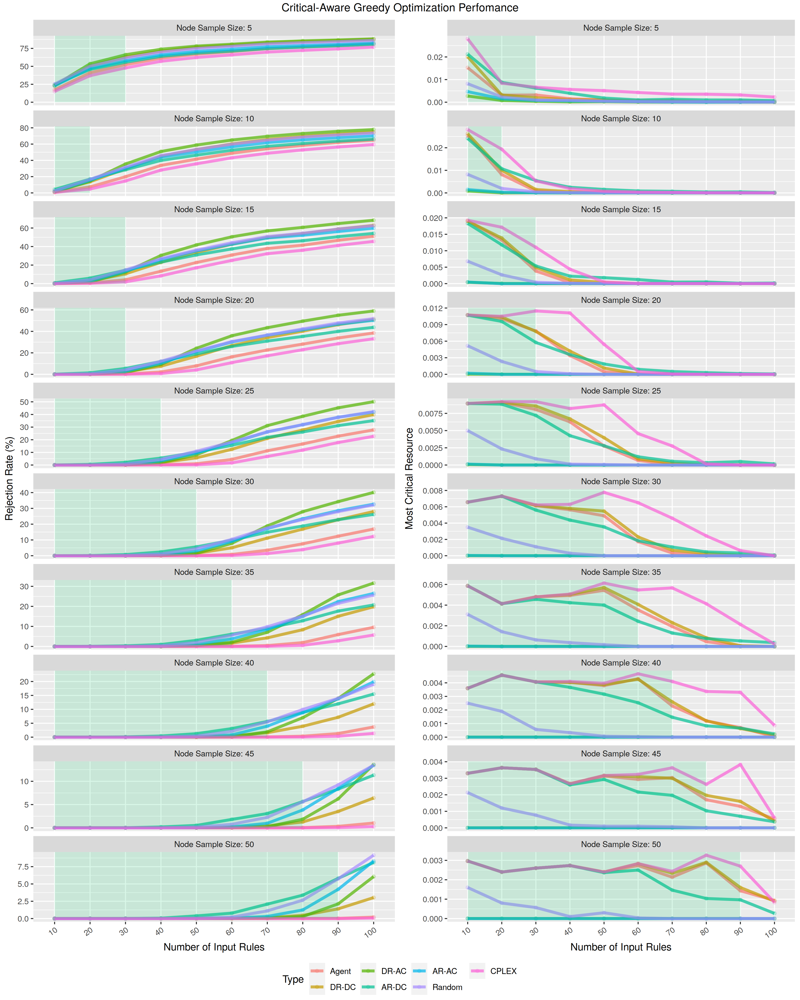
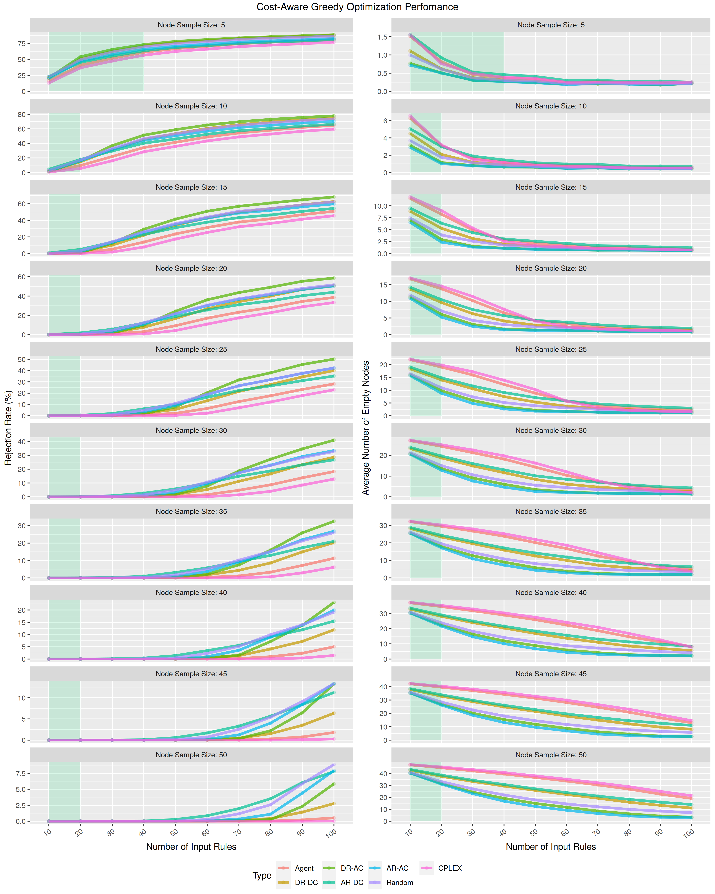

# Transformer Pointer-Critic

## Contents

- [Problem Statement](#problem-statement)
- [Repository Structure](#repo-structure)
- [Agent, Env, training and testing configuration](#configuration)
- [Training and Testing](#training-and-testing)
- [Results](#results)
- [Potential Improvements and Interesting ToDos](#potential-improvements-and-interesting-todos)
- [References and Useful Links](#useful-links)

**For the rationale behind the architecture please check [Architecture Rationale](./Arch_Rationale.md)**

## Installation

```bash
python3 -m venv --system-site-packages ./venv
source ./venv/bin/activate
pip install --upgrade pip

# Install the actual deps
pip install -r requirements.txt
```

For more info check Tensorflow's [installation guide](https://www.tensorflow.org/install/pip).

## Architecture Details

**Simple Overview**


## Problem Statement

### Goal

Given a set of tasks (a.k.a. `Rules`, aka web `Resources`), decide for the best `Rule` distribution across a set of devices (each having a random amount of CPU, RAM and storage resources) while taking into account the QoS.

Three QoS are considered:

- **Greedy Distribution** - Place as much `Rules` as possible
- **Fair Distribution** - Place as much `Rules` as possible but ensure that all node receive a fair amount of `Rules` to process
- **Cost Distribution** - Place as much `Rules` as possible but minimize the number of nodes while doing it

### Input Representation

**Input example with 2 Nodes and 2 `Rules` to distribute**

```python
array([
    [ 0.00, 0.00, 0.00], -> Node EOS. Rejected `Rules` will be "placed" here
    [ 0.70, 0.80, 0.40], -> Node 1. Remaining CPU: 0.70 | Remaining RAM: 0.80 | Remaining Storage: 0.40
    [ 0.50, 0.40, 0.20], -> Node 2. Remaining CPU: 0.50 | Remaining RAM: 0.40 | Remaining Storage: 0.20
    [ 0.10, 0.12, 0.17]  -> Rule 1. Required CPU: 0.10 | Required RAM: 0.12 | Required Storage: 0.17
    [ 0.18, 0.32, 0.16]  -> Rule 2. Required CPU: 0.18 | Required RAM: 0.32 | Required Storage: 0.16
    ],
    dtype=float32, shape=(5, 5))
```

### Repo structure

```
.
├── agents
│ ├── agent.py - Agent Class implementation
│ ├── models
│ │ └── transformer - Contains of the actor and the critic models
│ ├── plotter.py - Plots the losses and the stats
│ └── trainer.py - Training function
├── configs - Centralized location for configuring the Agent, Env., training and testing
│ ├── configs.py - Loader helper method
│ └── ResourceV3.json - Actual configs file
├── environment
│ ├── env_factory.py - Helper init and load the environment
│ ├── custom
│ │ ├── resource_v3
│ │ │ ├── attention_plotter.py - Plots attention for potential policy analysis
│ │ │ ├── env.py - Environment Class implementation
│ │ │ ├── heuristic - Contains baseline heuristics implementation
│ │ │ ├── misc - Contains helper function
│ │ │ ├── node.py - Node Class implementation
│ │ │ ├── resource.py - Task/`Rule`/`Resource` Class implementation
│ │ │ ├── reward.py - Contains the implementation of different rewards
│ │ │ └── tester.py - Testing function
├── main.py
├── requirements.txt
├── results
├── test_agent.py
└── tests
    ├── runner.py
    └── unit
```

### Configuration

The of the Env., Agent, the training and the testing is centralized and located in `configs/ResourceV3.json`

```js
{
    "trainer_config": {
        "description": "Trainer function configs.",
        "n_iterations": 100000,
        "n_steps_to_update": 30,

        "export_stats": {
            "export_stats": true,
            "folder": "training"
        },

        "store_model_weights": {
            "export_weights": true,
            "folder": "model",
            "filename": "actor"
        }
    },

    "tester_config": {
        "description": "Testing function configs.",

        "add_brakes": false,

        "show_per_test_stats": true,
        "show_inference_progress": true,
        "show_solutions": false,
        "show_detailed_solutions": false,
        "plot_attentions": false,
        "batch_size": 1,

        "testbed" : {
            "num_tests": 100,
            "node_sample_configs": {
                "min": 5,
                "max": 50,
                "step": 5
            },
            "node_available_resources": {
                "min": 0,
                "max": 100,
                "step": 100
            },
            "request_sample_configs": {
                "min": 10,
                "max": 100,
                "step": 10
            }
        },

        "heuristic": {
            "dominant_resource": {
                "generate_params_combos": true,
                "resource_sort_descending": true,
                "node_sort_descending": true
            },
            "random": {},
            "cplex_greedy_and_critical": {
                // Disabled by default. If needed, you need to have docplex lib installed
                // More info: https://ibmdecisionoptimization.github.io/docplex-doc/
                "use": false,
                "greedy_with_critical_resource": false,
                "time_limit_ms": 60000,
                "num_threads": 8
            },
            "cplex_node_reduction": {
                // Disabled by default. If needed, you need to have docplex lib installed
                // More info: https://ibmdecisionoptimization.github.io/docplex-doc/
                "use": false,
                "time_limit_ms": 60000,
                "num_threads": 8
            }
        },

        "export_stats": {
            "global_stats": {
                "export_stats": true,
                "folder": "tests",
                "filename": "test"
            },
            "per_problem_stats": {
                "export_stats": false,
                "folder": "tests/per_instance"
            }
        }
    },

    "env_config": {
        "description": "Environment configs.",

        "batch_size": 128,
        "mask_nodes_in_mha": true,
        "generate_request_on_the_fly": false,

        "seed_value": 1235,

        "normalization_factor": 100,
        "decimal_precision": 2,

        "num_features": 3,
        "num_profiles": 1000,

        "profiles_sample_size": 20,
        "node_sample_size": 10,

        "EOS_CODE": -2,
        "req_min_val": 1,
        "req_max_val": 30,

        "node_min_val": 0,
        "node_max_val": 100,

        "reward": {
            "type": "greedy",
            "greedy": {},
            "single_node_dominant": {
                "rejection_penalty": -2
            },
            "global_dominant": {
                "rejection_penalty": -2
            },
            "reduced_node_usage": {
                "rejection_penalty": -2,
                "use_new_node_penalty": -1
            }
        }
    },

    "tpc": {
        "description": "Transformer Pointer Critic Agent configs.",
        "agent_config": {

            "gamma": 0.99,
            "values_loss_coefficient": 1.0,
            "entropy_coefficient": 0.01,
            "stochastic_action_selection": true,

            "actor": {
                "use_default_initializer": true,
                "num_layers": 1,
                "dim_model": 128,
                "num_heads": 8,
                "inner_layer_dim": 128,
                "encoder_embedding_time_distributed": true,
                "attention_dense_units": 128,
                "logit_clipping_C": 10.0,

                "learning_rate": 0.0001,
                "clipnorm": 1.0
            },

            "critic": {
                "use_default_initializer": true,
                "num_layers": 3,
                "dim_model": 128,
                "num_heads": 8,
                "inner_layer_dim": 512,
                "encoder_embedding_time_distributed": true,
                "last_layer_units": 128,
                "last_layer_activation": "linear",

                "learning_rate": 0.0005,
                "clipnorm": 1.0
            }
        }
    }
}
```

### Training and Testing

After configuring (see [Configuration](#Configuration)) run `main.py`. After the completion you will see a `End... Goodbye!` message.

### Results

The images below show the performance of the agent. As the baseline CPLEX (with a time limit of 60 seconds) and several simple heuristics are used. Green highlighted areas in the images below show the configurations where CPLEX was able to obtain optimal solutions.

**Greedy Results**


**Critical-Aware Results**


**Cost-Aware Results**


## Useful Links

- [Deep Reinforcement Learning: Pong from Pixels](http://karpathy.github.io/2016/05/31/rl/)
- [Deriving Policy Gradients and Implementing REINFORCE](https://medium.com/@thechrisyoon/deriving-policy-gradients-and-implementing-reinforce-f887949bd63)
- [Understanding Actor Critic Methods and A2C](https://towardsdatascience.com/understanding-actor-critic-methods-931b97b6df3f)
- [Beam Search](https://machinelearningmastery.com/beam-search-decoder-natural-language-processing/)

### Pointer Critic

- [Neural Combinatorial Optimization with Reinforcement Learning](https://arxiv.org/pdf/1611.09940.pdf)
- [Presentation Video - Neural Combinatorial Optimization with Reinforcement Learning](https://www.youtube.com/watch?v=mxCVgVrUw50)
- [Reviews - Neural Combinatorial Optimization with Reinforcement Learning](https://openreview.net/forum?id=rJY3vK9eg)
- [Reinforcement Learning for Solving the Vehicle Routing Problem](https://arxiv.org/pdf/1802.04240.pdf)
- [Order Matters: Sequence to sequence for sets](https://arxiv.org/pdf/1511.06391.pdf)
- [Attention, Learn to Solve Routing Problems!](https://arxiv.org/abs/1803.08475)

### Unit Test and Coverage

```bash
python environment/custom/resource/tests/runner.py
```

or to generate an HTML-based coverage file

```
coverage run tests/runner.py && coverage html --omit=*/venv/*,*/usr/*,*/lib/*,*/tests/* -i
```

## Potential Improvements and Interesting ToDos

### Implement Self-Critic

Instead of using a dedicated network (the `Critic`) to estimate the state-values, which are used as a baseline, use [greedy rollout baseline](https://arxiv.org/abs/1612.00563). Greedy rollout baseline in [Attention, Learn to Solve Routing Problems!](https://arxiv.org/abs/1803.08475) shows promising results.

## How to do it

The easiest (not the cleanest) way to implement it is to create a `agents/baseline_trainer.py` file with a 2 instances (`env` and `env_baseline`) of environment and agents (`agent` and `agent_baseline`).

Then:

- When we sample a state from `env` we would copy it state into `env_baseline`.
- Delete the `critic` model from `agent` and `agent_baseline` as it's no longer necessary.
- Copy the network weighs for `agent` actor into `agent_baseline` actor.
- Set `agent_baseline.stochastic_action_selection` to `False`. This way the agent will select the action in a greedy way.
- The `agent` would gather rewards from `env` and `agent_baseline` would do the same with `env_baseline`.

### Implement Vehicle Routing Problem environment

It would be interesting to see how the network performs in VRP

## How to do it

- Look at the `KnapsackV2` and `ResourceV3` environments in `environments/custom` and adapt them to the VRP
- Add the VRP env to `environments/env_factory.py`
- Add the `JSON` config file into the `configs` folder.
