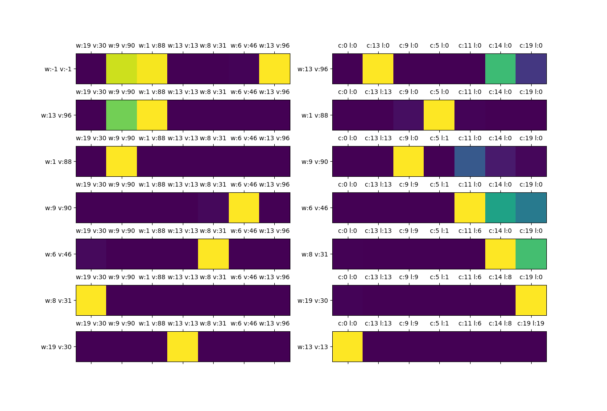

# Double Transformer Pointer-Critic

## Architecture Details

**Simple Overview**


**Detailed Overview**


## Multiple Knapsack Problem
Given a set of items, `x = {x_1, x_2, ..., x_i}` where each item has it's own weight `w_i` and value `v_i`, and a set of backpacks, `m = {m_1, m_2, ..., m_j}` each having a capacity `c_j`, the goal is to select a subset of items and place them into the backpacks in a way that total profit of the selected items is maximized.

### Policy Analysis of the Multiple Knapsack Problem
A simple test were performed to analyze the policy that the networks created. 

Environment configuration for testing and training:
- Set size of items: `100`
- Item value: random in [`1`, `100`] range
- Item weight: random in [`1`, `20`] range
- Set size of backpacks: `20`
- Backpack capacities: random in [`1`, `20`] range

Training configs:
- Batch size: `32`
- Number of epochs: `500`
- Total number of problems used during testing: `32 * 500 = 16000` 
- Item sample size: `20`
- Backpack sample size: `5`

> **Note:** Items and backpacks are randomly sampled from their respective sets

Testing configs:
- Batch size: `1`
- Item sample size: `7`
- Backpack sample size: `6 + 1`. `+ 1` is the empty backpack where items that weren't selected are placed.

The figure below shows the item selection and placement sequence. Plots in the left column represent the probabilities of selecting an item during as each decoding step. Plots in the right column represent the probabilities of placing the item, selected previously, at a specific backpack. Each row in the figure (tuple of plots) represents the selected item and the place where it will be placed.

#### Problem Instance 1
Solution quality:
```bash
Opt 381.0 || Net 381.0 | % from Opt 0.00 || Heuristic 351.0 | % from Opt 7.87
```

**Item selection and placement sequence**

> **Legend to the figure:** `w` and `v` represent the weight and the value of an item; `c` and `l` represent the maximum capacity and the current load of a backpack.

#### Problem Instance 2
Solution quality:
```bash
Opt 341.0 || Net 341.0 | % from Opt 0.00 || Heuristic 268.0 | % from Opt 21.41
```
**Item selection and placement sequence**

> **Legend to the figure:** `w` and `v` represent the weight and the value of an item; `c` and `l` represent the maximum capacity and the current load of a backpack.


## Setting the environment and installing the dependencies
Follow Tensorflow's [installation guide](https://www.tensorflow.org/install/pip) to set the environment and get things ready.

> I'm using Python v3.6 and Tensorflow v2.1


## Useful Links
- [Deep Reinforcement Learning: Pong from Pixels](http://karpathy.github.io/2016/05/31/rl/)
- [Deriving Policy Gradients and Implementing REINFORCE](https://medium.com/@thechrisyoon/deriving-policy-gradients-and-implementing-reinforce-f887949bd63)
- [Understanding Actor Critic Methods and A2C](https://towardsdatascience.com/understanding-actor-critic-methods-931b97b6df3f)
- [Beam Search](https://machinelearningmastery.com/beam-search-decoder-natural-language-processing/)

### Pointer Critic
- [Neural Combinatorial Optimization with Reinforcement Learning](https://arxiv.org/pdf/1611.09940.pdf)
- [Presentation Video - Neural Combinatorial Optimization with Reinforcement Learning](https://www.youtube.com/watch?v=mxCVgVrUw50)
- [Reviews - Neural Combinatorial Optimization with Reinforcement Learning](https://openreview.net/forum?id=rJY3vK9eg)
- [Reinforcement Learning for Solving the Vehicle Routing Problem](https://arxiv.org/pdf/1802.04240.pdf)
- [Order Matters: Sequence to sequence for sets](https://arxiv.org/pdf/1511.06391.pdf)
- [Attention, Learn to Solve Routing Problems!](https://arxiv.org/abs/1803.08475)