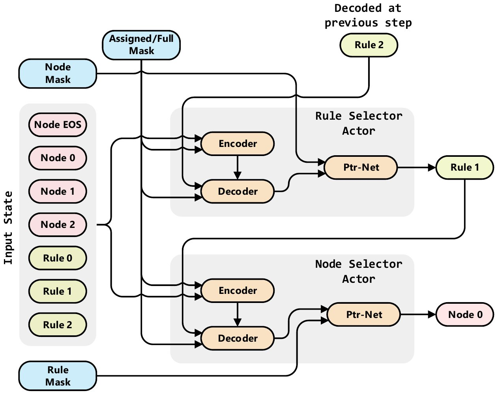

# Double Transformer Pointer-Critic

**For the rationale behind the architecture please check [Architecture Rationale](./Arch_Rationale.md)**

## Architecture Details

**Simple Overview**


**Detailed Overview**


## Resource Placement at Edge Devices

**Tech Background**


In real world, the nodes (virtual or physical) usually are located behind a reverse proxy such as NGNIX, Traefik or Moleculer API Gateway. All of them provide load balancing capabilities. NGNIX [offers](http://nginx.org/en/docs/http/load_balancing.html) round-robin, least-connected, ip-hash; Traefik, at this moment, only [supports](https://docs.traefik.io/routing/services/#load-balancing) round-robin method; Moleculer API Gateway [offers](https://moleculer.services/docs/0.14/balancing.html#Built-in-strategies) round-robin, random, CPU usage-based and sharding. These load balancing strategies don't provide optimal solutions because it's too expensive to look for them in real-time. Instead, these strategies trade the quality of solution for the response time, i.e., these strategies are fast but the solutions that they provide can be can be suboptimal.

In containerized environments, where nodes are in containers, there is usually a container manager. 

software such as [Kubernetes](https://kubernetes.io/blog/2016/07/autoscaling-in-kubernetes/).

**Problem statement**: 
Given a set of nodes/devices available for processing. Each node has the following characteristics:
- `100` units of CPU available for processing
- `20` units of RAM available for processing
- `50` units of memory available for processing

it also contains the range of tasks that it can process without penalty (e.g., a node can maintain an active connection with a weather API service or it can have the desired info in cache; if not, then fetching required data from some remote place is required, a process that will require more memory, RAM and CPU):
- `2` lower bound ID of the tasks that a node can process without penalty
- `5` upper bound ID of the tasks that a node can process without penalty

> Note: In the example above the lower and upper bounds mean that that specific node can process tasks (`2`, `3`, `4`, `5`) without any additional penalty.

Moreover, at each time `t` a randomly sized batch of user's requests arrive, each has its own profile with the following information:

The amount of resources that it needs in order to be processed properly. For example:
- `10` units of CPU
- `2` units of RAM
- `5` units for Memory

The profile also contains info about the type of the request. For example
- `1` or `0` depending if the user is `premium` or `free`
- `2`(or any other number) type of the task. Representing the specific need of the request. For example, specific request might need the presence of the GPU or additional data that needs to be fetched in order to be properly processed.

**Goal**: The goal is to design a load balancing strategy that's able to distribute the incoming requests across the devices. The designed strategy must prioritize the `premium` requests and, when possible, satisfy the `free` requests.

**Purpose of the Neural-based load balancing strategy**: A Neural-based load balancing strategy can adapt the distribution policy (heuristic) according to the incoming user's requests and the state of the nodes and, thus, offer a "better" way of placing the requests.

**Input Representation**
```bash
array([
    [ 0., 0., 0., 0., 0.],  -> Node EOS. Rejected items will be "placed" here
    [ 70., 80., 40., 4., 7.] -> Node 1. Remaining CPU: 70 | Remaining RAM: 80 | Remaining Memory: 40 | Tasks without penalty `4`, `5`, `6`, `7`
    [ 50., 40., 20., 1., 4.] -> Node 2. Remaining CPU: 50 | Remaining RAM: 40 | Remaining Memory: 20 | Tasks without penalty `1`, `2`, `3`, `4`
    [ 10., 12., 17., 3., 3.] -> Request 1. Required CPU: 10 | Required RAM: 12 | Required Memory: 17 | Task: 3 | User Type: 0 (`free`)
    [ 18., 32., 16., 4., 4.] -> Request 1. Required CPU: 10 | Required RAM: 12 | Required Memory: 17 | Task: 4 | User Type: 1 (`premium`)
    ],
    dtype=float32, shape=(5, 5))
```

## Useful Links
- [Deep Reinforcement Learning: Pong from Pixels](http://karpathy.github.io/2016/05/31/rl/)
- [Deriving Policy Gradients and Implementing REINFORCE](https://medium.com/@thechrisyoon/deriving-policy-gradients-and-implementing-reinforce-f887949bd63)
- [Understanding Actor Critic Methods and A2C](https://towardsdatascience.com/understanding-actor-critic-methods-931b97b6df3f)
- [Beam Search](https://machinelearningmastery.com/beam-search-decoder-natural-language-processing/)

### Pointer Critic
- [Neural Combinatorial Optimization with Reinforcement Learning](https://arxiv.org/pdf/1611.09940.pdf)
- [Presentation Video - Neural Combinatorial Optimization with Reinforcement Learning](https://www.youtube.com/watch?v=mxCVgVrUw50)
- [Reviews - Neural Combinatorial Optimization with Reinforcement Learning](https://openreview.net/forum?id=rJY3vK9eg)
- [Reinforcement Learning for Solving the Vehicle Routing Problem](https://arxiv.org/pdf/1802.04240.pdf)
- [Order Matters: Sequence to sequence for sets](https://arxiv.org/pdf/1511.06391.pdf)
- [Attention, Learn to Solve Routing Problems!](https://arxiv.org/abs/1803.08475)

### Unit Test and Coverage
```bash
python environment/custom/resource/tests/runner.py
```
or 
```bash
coverage run environment/custom/resource/tests/runner.py 
```

```bash
coverage html --include=environment/*
```